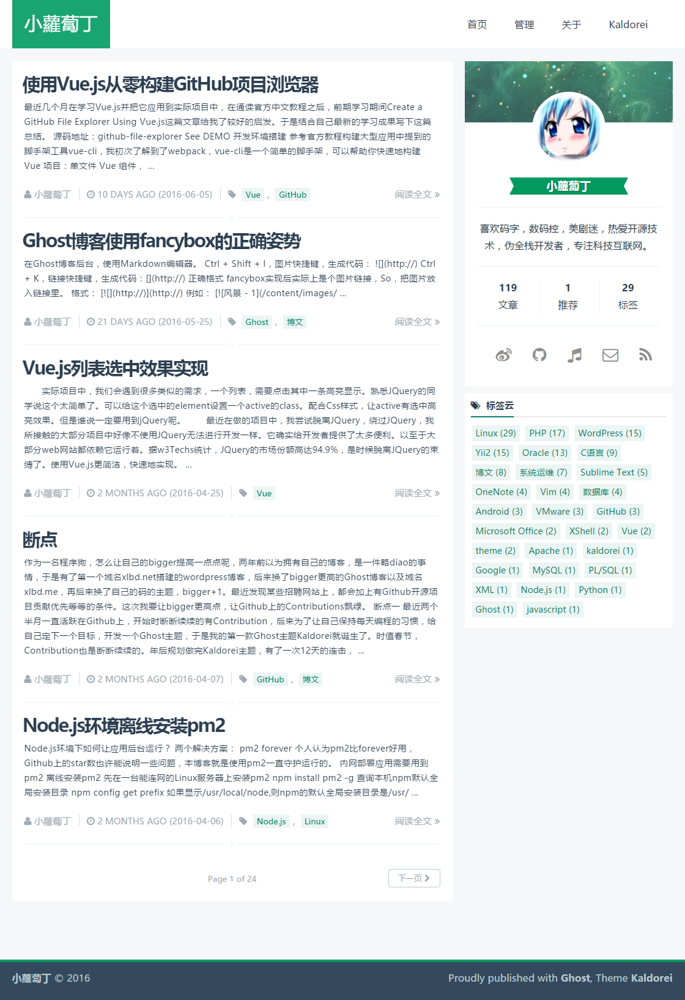
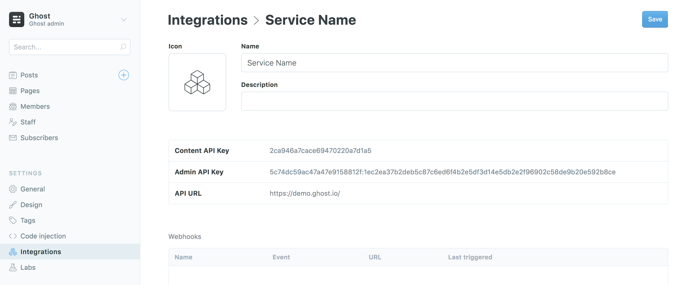
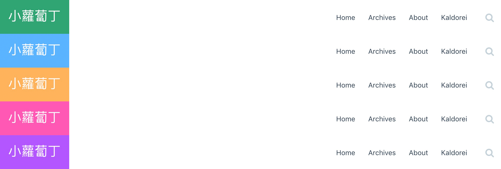

# Yaldorei
A Simple And Elegant Ghost Theme Yadorei **Modified** From [Kaldorei](https://github.com/xiaoluoboding/ghost-theme-kaldorei) Which Derive From Default Theme Casper. **Most development was made by the former author**. Maybe the former author xiaoluoboding will update kaldorei soon and then I will also modify it to make it more simple. 


Support ghost 2.x
# Preview
## Former

## Now
[Blog](http://www.xmsec.cc)

## About Modified Theme Yaldorei

Modified theme Yaldorei support ghost 1.25.0 & ghost 2.0    
What is modified is as follows:    

1. The nav's hight
2. The footer's padding
3. Index post meta height
4. Index pagination height
5. Tag clould in post page removed
6. Post pages' fence layout
7. Color simplified  
8. CSS not mentioned above modified slightly
9. Some author info removed&simplified 
10. Change the data creat_at in posts to changed_at
11. Update to Kaldorei 2.1.0

Theme name was made since Yaldorei sounds like someone'name Yan DY I met.

## How to use

### 🌐 切换语言

Ghost2.x版本中支持了语言的切换，Kaldorei 同时也支持了中/英文的切换，默认为英文 `en`。

> 方法：ghost后台 > `General` > `Publication Language` 改为 `zh` 即可

### 🏷️ 标签统计
Kaldorei使用了ghost的api来做统计，所以需要开启ghost的实验室中的`Public API`功能。

> 方法：ghost后台 > `labs` > `Enable Beta Features` > `勾选 Public API`

### 🌄 图片幻灯片
Kaldorei集成了fancyBox，支持图片暗箱效果、幻灯片轮播、全屏预览、缩略图预览等功能。预览&使用方法[图片预览](http://xlbd.me/how-to-use-fancybox-in-ghost-blog/)

### 💬 开启Disqus
Kaldorei支持Disqus讨论插件，只需在后台`代码注入`处添加一段代码。

> 方法：ghost后台 > `Code Injection` > `Blog Header`

```js
<script>
    var disqus_shortname = 'your_disqus_shortname';
</script>
```

### 🗂 开启归档功能
Kaldorei提供了简单的归档功能，使用ghost的api来生成归档，预览[博客归档](http://xlbd.me/archives)。

> 方法：ghost后台:
> * New Post > 标题输入`Archives`，这时文章的地址默认为`archives`;
> * Post Settings > 勾选`Turn this post into a page`，然后Publish;
> * Navigation > 创建一个`归档`导航，地址为：http://your_blog_url/`archives`;
> * 去博客首页看看你的归档吧，Have fun.

### 🌈 更换代码主题
Kaldorei使用[highlight.js](https://github.com/isagalaev/highlight.js)实现代码高亮，默认使用的主题风格为 `monokai-sublime`

> 方法：ghost后台 > `Code Injection` > `Blog Header`

```html
<!-- use solarized-light style -->
<link rel="stylesheet" type="text/css" href="/assets/plugins/highlight-latest/styles/solarized-light.css" />
```

[完整主题列表](https://highlightjs.org/static/demo/)

### 🔍 搜索功能

搜索引擎默认支持按博文标题搜索，此功能需要安装的 `ghost` 版本 >= `2.10.x`。

分为两步：

#### 1、创建自定义集成

> 方法：ghost后台 > `Integrations` > `Add custom integration`



#### 2、配置变量

> 方法：ghost后台 > `Code Injection` > `Blog Header`

```javascript
// 
<script>
  var searchSettings = {
    key: '__CONTENT__API__KEY__',  // Your custom integration Content API Key
    host: '__API__URL__',  // Your custom integration API URL
  };
</script>
```

### 🌈 自定义配色与字体

`kaldorei` v2.1.0 版本开始，支持了用户可以自定义站点的配色与字体。



> 方法：ghost后台 > `Code Injection` > `Blog Header`

```html
<style>
:root {
  --primary-color: #4af;
  --primary-light-hover: #4cf;
  --primary-dark-hover: #49f;
}
</style>
```

完整可替换变量，参见[这里](https://github.com/xiaoluoboding/ghost-theme-kaldorei/blob/master/assets/css/variables.css)

## About ghost helpers

Kaldorei用两种方法实现了标签云，方法参见[我的博客](http://xlbd.me/how-to-add-the-tag-cloud-into-ghost-blog/)。

Kaldorei优化了发布文章的时间展示，并汉化为中文，需要修改时间(date)助手，方法参见[我的博客](http://xlbd.me/ghost-date-i18n/)。

## Credits

* [font-awesome](https://github.com/FortAwesome/Font-Awesome)
* [bootstrap](https://github.com/twbs/bootstrap)
* [highlight.js](https://github.com/isagalaev/highlight.js)
* [velocity.js](https://github.com/julianshapiro/velocity)
* [jquery.toc.js](https://github.com/jgallen23/toc)
* [anijs](https://github.com/anijs/anijs)
* [jquery.githubRepoWidget.js](https://github.com/JoelSutherland/GitHub-jQuery-Repo-Widget)
* [fancyBox](https://github.com/fancyapps/fancyBox)
* [Ghost Search](https://github.com/HauntedThemes/ghost-search)

## License

MIT © [xiaoluoboding](https://github.com/xiaoluoboding)
